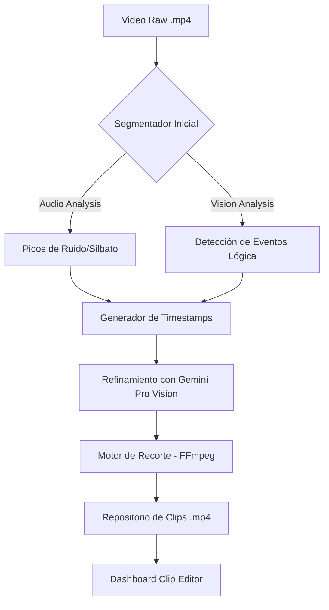

# Guía Técnica: Recorte Automático de Clips de Balonmano (7metrics AI)

Esta guía detalla la arquitectura y el flujo de trabajo para el sistema de recorte automático de jugadas, integrando visión por computadora (CV) y modelos de lenguaje multimodal (LMM) como Google Gemini.

---

## 1. Arquitectura del Sistema de Recorte

El proceso se divide en tres capas principales:

### A. Capa de Ingesta y Pre-procesamiento
*   **Decodificación**: Extracción de frames clave a 30fps.
*   **Análisis de Audio**: Detección de picos de ruido (silbatos del árbitro, gritos de gol) para marcar "puntos de interés" temporales.
*   **Optimización**: Uso de *Frame Skipping* (analizar 1 de cada 5 frames) para la detección inicial de eventos globales.

### B. Capa de Detección de Eventos (IA)
Basado en el **Manual de Lógica de Negocio**, el sistema busca:
1.  **Goles**: Detección del balón cruzando el plano de la portería + celebración de jugadores.
2.  **Asistencias**: Identificación del último pase previo a un gol (ventana de 3 segundos).
3.  **Bloqueos**: Intercepción de trayectoria del balón por un defensor con brazos extendidos.
4.  **Faltas Técnicas**: Pasos (traveling) y dobles regates mediante análisis de la cinemática del jugador y el bote del balón.

### C. Algoritmo de Ventana Temporal (Slicing Logic)
Para que un clip sea útil para un entrenador, no basta con el momento exacto del evento.
*   **Pre-Contexto (Lead-in)**: 5 - 8 segundos antes del evento (para ver la jugada táctica).
*   **Evento (Peak)**: El momento exacto del gol o falta.
*   **Post-Contexto (Burn-out)**: 2 - 3 segundos después (para ver la reacción o el reinicio).
*   **Fusión de Clips**: Si dos eventos ocurren muy seguidos (ej. un robo y un gol de contraataque), el sistema los fusiona en un solo clip de "Transición".

---

## 2. Flujo de Trabajo (Backend Pipeline)

---

## 3. Implementación del Backend (Lógica de Recorte)

El backend utiliza **FFmpeg** para el recorte sin pérdida de calidad (stream copy) basándose en los metadatos generados por el motor de IA.

### Parámetros de Extracción
*   **Codec**: H.264 / H.265.
*   **Metadatos**: Cada clip se etiqueta con `player_id`, `team`, `action_type` y `timestamp_match`.
*   **Calibración de Homografía**: Los clips de jugadas tácticas incluyen un overlay opcional con la posición 2D de los jugadores en la pista de 40x20m.

---

## 4. Optimización de Recursos

1.  **Paralelización**: Procesamiento de diferentes segmentos del partido en paralelo usando workers.
2.  **Filtrado por Relevancia**: Los clips se puntúan por "Intensidad" (basado en audio y movimiento). Solo se exportan automáticamente los de puntuación alta (Top Plays).
3.  **Smart Caching**: Los embeddings de Re-ID se guardan para no tener que re-identificar jugadores en cada clip individual.

---
*Documentación generada para el equipo de Ingeniería de 7metrics AI.*
